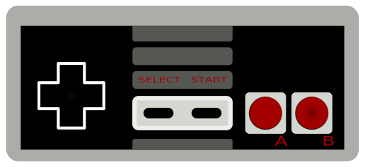

<!-- README.md is generated from README.Rmd. Please edit that file -->

```{r, echo = FALSE}
knitr::opts_chunk$set(
  collapse = TRUE,
  comment = "#>",
  fig.path = "man/figures/"
)
```


# gamer 

gamer is a collection of games built using R and Shiny that you can play locally.

## Installation

```{r, eval = FALSE}
# Install development version from GitHub
devtools::install_github("anthonypileggi/gamer")
```

## Usage

All available games can be accessed using the `play` function.

```{r}
library(gamer)

# I just don't know what I want to play...
play()
```

```{r, eval = FALSE}
# Oh hey, speed-math sounds cool....
play("speed-math")

# Hey, that was fun!
```

## The Future

This package is still under-development while we add more games.  

**Thanks for playing!**